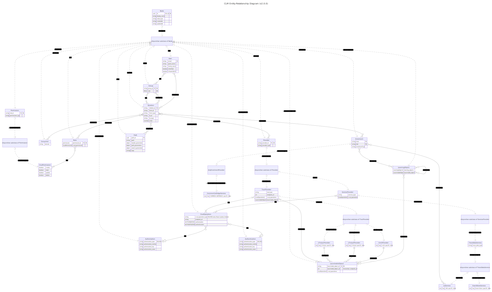

# What is the Common Learning Middleware?

The connection of different educational technologies and specialized services to large educational ecosystems using open standards is a central use case of the Common Learning Middleware (CLM). Based on the Best-of-Breed strategy, various providers of educational offerings can connect their learning content via the CLM with a publish-subscribe system in order to increase their own reach. The CLM supports - to facilitate integration - common standards of a seamless educational journey and is even able to translate from one standard of a client system to an alternative standard supported by the target system at runtime of a request. 

The CLM serves as an intermediary between learning applications and learning content, while the integration of further standards enables providers to offer advanced services such as AI-supported systems, recommender systems or learning analytics systems via the CLM.

## Reference Projects

The middleware approach has already been tested in various settings
* Prototype of German National Education Platform “mEDUator”: https://meduator.fokus.fraunhofer.de/
* Research Study “AI in LMS” for the German Armed Forces: https://kilms.fraunhofer.de/ 
* In various German government-funded projects to connect adaptive educational technologies; such as
   * Control&Connect: https://www.fokus.fraunhofer.de/en/projects/fame/control_connect_23-05 
   * EXPAND+ER WB³: https://www.fokus.fraunhofer.de/en/project/fame/expander_2021-12 
   * TripleAdapt: https://www.fokus.fraunhofer.de/en/fame/projects/tripleadapt 

### Video Explanation

The following video explain CLM from the perspective of a user.

#### Short explanation video of the user perspective (German only)
https://github.com/fraunhoferfokus/clm-core/assets/135810890/44a340ab-1d86-4930-9c08-bffe457bc222


## OPEN CLM-CORE
This is the core module from which all other microservices inherit to extend their own functionality. The focus here is on user and rights management as well as the relationship model. Together with the other six services, this forms the Open-Core package of the Common Learning Middleware.

The Core of the Common Learning Middleware and selected submodules are Open Source, meaning that many relevant use cases can already be implemented in educational ecosystems. Nevertheless, there are a number of other CLM submodules that supplement the infrastructure with important additional functions, specifications & standards, graphical interfaces, etc. and which are not currently Open Source. If you are interested in additional functions or premium features or if you cannot use the software under the specified license for certain reasons, please contact the CLM developers.

## Submodules
The following Open Source submodules which extend the basic functionalities with additional features are part of the Open-Core package of the Common Learning Middleware:
* [clm-core (this module)](https://github.com/fraunhoferfokus/clm-core): Description above
* [clm-ext-service_providers](https://github.com/fraunhoferfokus/clm-ext-service_providers): This service is utilized for managing service providers. In the CLM framework, service providers act as an abstraction layer. They are responsible for registering launchable tools with CLM and making these tools accessible to learners through enrollments. A single service provider can encompass a variety of launchable tools. The configuration of the service provider is transmitted to these tools, unless a tool has its own specific configuration defined.
* [clm-ext-tools](https://github.com/fraunhoferfokus/clm-ext-tools): This service facilitates the management of Launchable Tools. Launchable Tools are those that are made available by CLM providers through supported standards. Currently, the standards supported are LTI 1.1, LTI 1.3, and CMI5. A Launchable Tool is never assigned directly to a learner or a group; instead, it is always associated within the context of a Learning Object.
* [clm-ext-learning_objects](https://github.com/fraunhoferfokus/clm-ext-learning_objects): This service facilitates the management of learning objects. Learning objects are essentially courses, which can be nested within each other as needed. A learning object becomes a 'launchable object' when it is linked to a tool capable of being launched. Enrollments to these learning or launchable objects can be made via existing users and groups. Once enrolled, a user is authorized to access and utilize the associated tool.
* [clm-ext-launch](https://github.com/fraunhoferfokus/clm-ext-launch): This service is used to allow clients to execute a launch request (LTI, CMI5) and then display the content in the client system. This service can also translate between different launch specifications offered by the different tools. The groups/user assignments determine whether a content is launched for the context of a user.
* [clm-ext-tracedata](https://github.com/fraunhoferfokus/clm-ext-tracedata): This service is utilized for persisting xAPI statements from learners when they submit learning activities through a content provider. It routes the appropriate statements to the associated learning records stores based on group affiliations.
* [clm-ext-swagger](https://github.com/fraunhoferfokus/clm-ext-swagger): Serves as a documentation service of the Open-core package. Dynamically retrieves the Open API specification of the deployed microservices.	

## Requirements
- MariaDB, set up locally. This service leverages a database (DB) as the cornerstone for storing documents persistently. To establish a connection with MariaDB, it is essential that the database is secured through username and password authentication. Therefore, in order to run this service it is  required to create a database within the MariaDB and configure it with a username and password for access control
  * MariaDB Installation: https://mariadb.com/kb/en/getting-installing-and-upgrading-mariadb/
  * For setting up the password of a user: https://mariadb.com/kb/en/set-password/
  
- Node.js 20.x: https://nodejs.org/en/download

### Folder Structure
root

├── api-docs # Open API 3.0.0 definition as .yaml file documenting all routes and data models this service offers.

├── docs # Developer documentation of all functions, classes, interfaces, types this service exposes as an npm package.

├── dist # The built TypeScript project transpiled to JavaScript.

└── src # Business-relevant logic for this web server.


### Architecture



The Entity Relationship Model of the Open Core is shown above. 

The clm-core module includes the management of the following resources:

#### Groups
- Can be nested hierarchically.
- Users can be assigned to groups.
- Access to resources is controlled by group permissions, which is context-dependent.

#### Roles
- Always associated with a group.
- Specifies the permissions for accessing resources.

#### Users
- Can be registered through federated identity in the CLM, created through CLM's in-house user management, or added by an administrative person.
- Assigned to one or more groups.

#### Paths
- Represents a REST interface.
- A path is created for each interface offered by a microservice of the Open-Core.
- Paths are protected.

#### Consumers
- Entities that use the interfaces (paths) of the Open-Core.
- Assigned to groups which have access to specific paths.
- Permissions for paths are regulated through group assignments.

#### Relations
- Each resource is interconnected through a relation document.
- Join tables or graphs enable a flexible permission model.

This service functions as a web microservice that can be orchestrated through a gateway and as an npm package to provide functionalities to other CLM extensions. A microservice can build upon the classes/types/interfaces of this service to extend basic functionalities.

## Setup for Testing the Webserver
1. The service's configuration can be customized by referring to the `.env` file. Within this file, the `MARIA_CONFIG` variable should be updated with the appropriate values to reflect the user's specific database settings. Refer to the `MARIA_CONFIG` variable in the table below to see which comma seperated value refers to which respective database setting.  
2. `npm install`
3. Copy the file `.env.default`, rename it to `.env` and overwrite necessary properties.

   The following table gives an overview of the settings you can change through the environment variables:

   | Name                   | Example                                                                           | Required (Yes/No) | Description                                                                                                     |
   | ---------------------- | --------------------------------------------------------------------------------- | ----------------- | --------------------------------------------------------------------------------------------------------------- |
   | `PORT`                 | `3001`                                                                            | Yes               | The port on which the service should be deployed.                                                               |
   | `DEPLOY_URL`           | `HOST_PROTOCOL://HOST_ADDRESS:GATEWAY_PORT/api`                                   | Yes               | The address where all microservices are to be orchestrated. A `/api` must be appended.                          |
   | `MARIA_CONFIG`         | `MARIA_HOST_ADDRESS\|MARIA_PORT\|MARIA_DATABASE\|MARIA_USER\|MARIA_USER_PASSWORD` | Yes               | A slash-separated string containing the configured parameters for MariaDB.                                      |
   | `CLM_ROOT_USER`        | `example@example.com`                                                             | Yes               | The username of the admin user installed during CLM setup.                                                      |
   | `CLM_ROOT_PASSWORD`    | `CLM_ROOT_PASSWORD`                                                               | Yes               | The password of the admin user installed during CLM setup.                                                      |
   | `TOKEN_SECRET`         | `secret`                                                                          | Yes               | Secret used to sign and verify JWTs for authentication. Have to be the same across all modules of the Open-Core |
   | `SMTP_FROM`            | `example@example.de`                                                              | No                | Configurations for the SMTP service used for sending emails.                                                    |
   | `SMTP_HOST`            | `smtp.example.com`                                                                | No                | Configurations for the SMTP service used for sending emails.                                                    |
   | `SMTP_PORT`            | `465`                                                                             | No                | Configurations for the SMTP service used for sending emails.                                                    |
   | `SMTP_USER`            | `example@user.de`                                                                 | No                | Configurations for the SMTP service used for sending emails.                                                    |
   | `SMTP_PASS`            | `examplepassword`                                                                 | No                | Configurations for the SMTP service used for sending emails.                                                    |
   | `REDIS_CONFIG`         | `localhost:6379`                                                                  | No                | Configuration information for Redis. Defaults to example value if not set.                                      |
   | `DISABLE_ERR_RESPONSE` | `true`                                                                            | No                | Flag to control whether error responses should be returned. Defaults to example value if not set.               |
   | `OIDC_PROVIDERS`       | [{"authorization_endpoint": "http://to_authorization_endpoint" }]                 | No                | Whether to allow access_token from external OIDC providers                                                      |
   | `API_TOKEN`            |                                                                                   | No                | Defaults to MGMT_SERVICE if not set. Needed to access the CLM-API
4. `npm run dev` for development with nodemon.
5. `npm start` for deployment.

6. Subsequently, the JSON representation of the Open-API specification should be accessible at:

`http://localhost:${PORT}/core/swagger`

**To access the API endpoints detailed in the Open-API specification, an API token is required. This token is generated during the initialization of the clm-core module. Please refer to the .env table**

## For Consumption as an NPM Package

- Documentation about all exposed modules can be found under `/docs`.
- Include the package in your project's `package.json` dependencies:

    ```json
    "dependencies": {
        "clm-core": "git+https://$token:$token@$url_of_package#$branch_name"
    }
    ```

- To use database-dependent DAOs/DTOs, inject `MARIA_CONFIG` into the environment before importing the module:

    a) Manually in the code:

    ```javascript
    process.env.MARIA_CONFIG = "localhost|3306|clm|root|12345";
    import * as core from 'clm-core';
    ```

    b) Through `.env` file:

    ```.env
    MARIA_CONFIG=localhost|3306|clm|root|12345
    ```

    ```javascript
    import * as core from 'clm-core';
    ```

# Swagger Documentation

- Accessible routes for this microservice are available at `http://localhost:PORT/core/swagger` after starting the service.
- Ensure to set up a reverse proxy to route traffic to the respective microservices as shown in the table.

### Changelog

The changelog can be found in the [CHANGELOG.md](CHANGELOG.md) file.

## Get in touch with a developer

Please see the file [AUTHORS.md](AUTHORS.md) to get in touch with the authors of this project.
We will be happy to answer your questions at {clm@fokus.fraunhofer.de}

## License


The project is made available under the license in the file [LICENSE.txt](license.txt)
