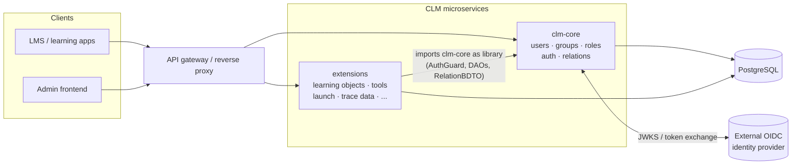
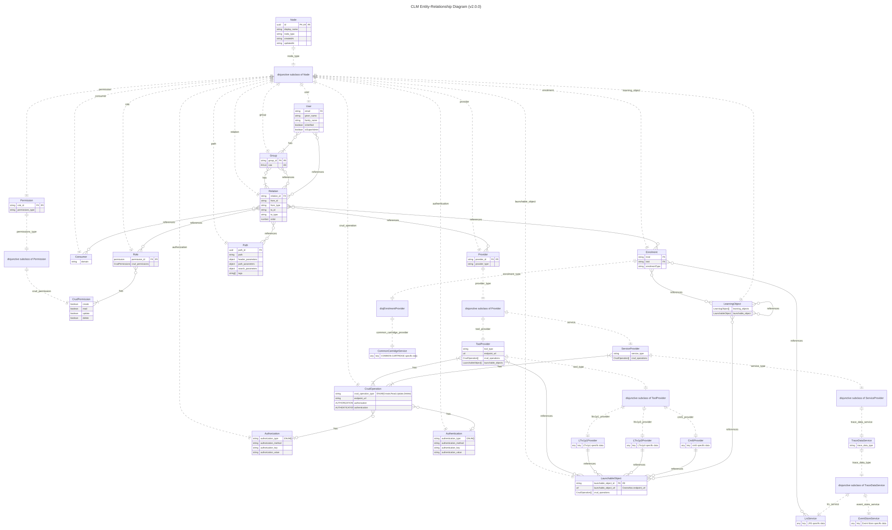

# CLM Core

[](https://github.com/fraunhoferfokus/clm-core/actions/workflows/ci.yml)
[](license.txt)


## What is the Common Learning Middleware?

The CLM connects educational technologies and specialised services into larger educational ecosystems based on open standards. Providers connect their learning content through the CLM with a publish-subscribe approach. The CLM supports common standards (LTI 1.1/1.3, cmi5, xAPI) and can translate between the standard of a client system and the standard of the target system at request time. Additional services such as recommender systems, AI-supported tutoring or learning analytics can be plugged in through the middleware.

The approach has been used in, among others:

- Prototype of the German National Education Platform "mEDUator": https://meduator.fokus.fraunhofer.de/
- Research study "AI in LMS": https://kilms.fraunhofer.de/
- Publicly funded projects on adaptive educational technologies, e.g. [Control&Connect](https://www.fokus.fraunhofer.de/en/projects/fame/control_connect_23-05), [EXPAND+ER WB³](https://www.fokus.fraunhofer.de/en/project/fame/expander_2021-12) and [TripleAdapt](https://www.fokus.fraunhofer.de/en/fame/projects/tripleadapt)

### Video explanation

Short explanation video of the user perspective (German only):

https://github.com/fraunhoferfokus/clm-core/assets/135810890/44a340ab-1d86-4930-9c08-bffe457bc222

### Open-core modules

| Module | Purpose |
| --- | --- |
| **clm-core** (this repository) | Users, groups, roles, authentication, relation model |
| [clm-ext-service_providers](https://github.com/fraunhoferfokus/clm-ext-service_providers) | Service providers that register launchable tools |
| [clm-ext-tools](https://github.com/fraunhoferfokus/clm-ext-tools) | Launchable tools (LTI 1.1, LTI 1.3, cmi5) |
| [clm-ext-learning_objects](https://github.com/fraunhoferfokus/clm-ext-learning_objects) | Nestable learning objects / courses and enrolments |
| [clm-ext-launch](https://github.com/fraunhoferfokus/clm-ext-launch) | Launch requests and translation between launch specifications |
| [clm-ext-tracedata](https://github.com/fraunhoferfokus/clm-ext-tracedata) | Persisting and routing xAPI statements to learning record stores |
| [clm-ext-swagger](https://github.com/fraunhoferfokus/clm-ext-swagger) | Aggregated OpenAPI documentation of all deployed services |

More CLM modules (additional standards, user interfaces, premium features) are not open source. If you need them, or cannot use the software under the AGPL, please contact the CLM team.

## What is clm-core?

`clm-core` is the identity, permission and relation core of the CLM. It manages users, groups, roles and API consumers, authenticates requests (local login, JWT, external OIDC providers) and provides the shared data model that all other CLM microservices build on. It runs as a standalone service and is also consumed as a library by the CLM extension services.

---

## Contents

- [Features](#features)
- [Quick start](#quick-start)
- [Architecture](#architecture)
- [Permission model](#permission-model)
- [Authentication](#authentication)
- [Configuration](#configuration)
- [Local development](#local-development)
- [Using clm-core as a library](#using-clm-core-as-a-library)
- [API documentation](#api-documentation)
- [Contributing, security and license](#contributing-security-and-license)

## Features

- **User and group management**: nested groups, users in multiple groups, self-registration with e-mail verification, bootstrap of admin users from environment variables.
- **Role-based access control**: every group is bound to a role; roles define CRUD rights per resource type, and rights are resolved along a relation graph, so permissions also flow through nested groups.
- **Two-layer authentication**: path-scoped **API tokens** identify the calling application, **user tokens** (JWT) identify the user. Both are checked on every request.
- **OIDC integration**:
  - accepts access tokens from trusted external identity providers (JWKS verification, `kid` handling, key caching per provider)
  - acts as an **OIDC broker** for client applications (authorization code flow, logout, discovery document)
  - optionally syncs groups and roles from a token claim
- **Extensible base classes**: `BaseModelController`, `BaseDAO`, `RelationBDTO`, `AuthGuard` and friends are exported, so extension services get CRUD routing, persistence and permission checks out of the box.
- **Operations ready**:
  - multi-stage Docker image that runs as a non-root user
  - `/health` and `/live` (DB ping) endpoints
  - structured logging with levels
  - auth rate limiting
  - resilient PostgreSQL pool with automatic reconnect

## Quick start

Requirements: Docker with Compose.

```bash
git clone https://github.com/fraunhoferfokus/clm-core.git
cd clm-core
docker compose up --build
```

This starts PostgreSQL and `clm-core` on port `3001` with development credentials from [docker-compose.yml](docker-compose.yml). On first start the service creates its tables, the default roles, the root user and a management API token.

```bash
# Liveness incl. database
curl http://localhost:3001/live
# {"status":"UP","db":"UP","durationMs":1}

# Log in as the bootstrap admin. The API token (Authorization header) identifies the calling application.
curl -X POST http://localhost:3001/core/authentication \
  -H 'Authorization: Bearer change-me-api-key' \
  -H 'Content-Type: application/json' \
  -d '{"email":"admin@example.org","password":"change-me-admin"}'
# {"accessToken":"eyJ...","refreshToken":"eyJ...","accessTokenExpiresIn":"...","userId":"admin@example.org"}

# Call a protected route with API token + user token
curl http://localhost:3001/core/mgmt/groups \
  -H 'Authorization: Bearer change-me-api-key' \
  -H 'x-access-token: <accessToken>'

# OpenAPI 3 specification of all routes
curl http://localhost:3001/core/swagger
```

> The credentials in `docker-compose.yml` are for local use only. Set your own secrets for any other environment (see [Configuration](#configuration)).

## Architecture


```mermaid
flowchart LR
    subgraph Clients
        LMS[LMS / learning apps]
        FE[Admin frontend]
    end
    IdP[(External OIDC<br/>identity provider)]
    GW[API gateway / reverse proxy]

    subgraph CLM["CLM microservices"]
        CORE["clm-core<br/>users · groups · roles<br/>auth · relations"]
        EXT["extensions<br/>learning objects · tools<br/>launch · trace data · ..."]
    end

    DB[(PostgreSQL)]

    LMS --> GW
    FE --> GW
    GW --> CORE
    GW --> EXT
    EXT -- "imports clm-core as library<br/>(AuthGuard, DAOs, RelationBDTO)" --> CORE
    CORE --> DB
    EXT --> DB
    CORE <-- "JWKS / token exchange" --> IdP
```

Every resource (user, group, role, learning object, tool, ...) is stored as a JSON document. All connections between resources are **relations** (`fromType:fromId → toType:toId`), which together form a graph. Permission checks, group membership and the course structures of the extension services are evaluated on this graph.



The model contains these resources:

| Resource | Purpose |
| --- | --- |
| **Users** | Local accounts, federated users created on first SSO login, or users created by an administrator. |
| **Groups** | Can be nested. Each group is bound to exactly one role. |
| **Roles** | CRUD permissions per resource type (see below). |
| **Paths** | Every route of every CLM service is registered as a path. API tokens are scoped to paths and HTTP methods. |
| **Consumers** | API tokens of client applications, together with their allowed paths. |
| **Relations** | The edges of the graph connecting all of the above. |

### Project structure

```
src/
├── server.ts              # Express app, rate limiting, health endpoints, bootstrap
├── config/                # Environment config, bootstrap of roles/admins/OIDC settings
├── controllers/           # REST controllers (auth, users, groups, roles, consumers, OIDC broker)
├── handlers/              # AuthGuard (API token + user auth + permission checks), error handler
├── models/                # Datamodels, DAOs, PostgreSQL adapter, relation graph (RelationBDTO)
├── services/              # JWT, JWKS/OIDC verification, OIDC group sync, e-mail, passwords
├── validationSchemas/     # express-validator schemas
└── lib/CoreLib.ts         # Public library API used by extension services
pages/                     # EJS pages of the OIDC broker (login, success)
views/                     # Pug e-mail templates
api-docs/                  # OpenAPI definition (YAML)
docs/                      # Generated API reference of the library (api-documenter)
```

## Permission model

A role assigns a permission bitmask to each resource type:

| Bit | Value | HTTP methods |
| --- | --- | --- |
| Read | `1` | `GET` |
| Create | `2` | `POST` |
| Update | `4` | `PUT`, `PATCH` |
| Delete | `8` | `DELETE` |

A request passes `AuthGuard.permissionChecker(resource, targets)` if **both** of these hold:

1. One of the caller's group roles has the required bit for the resource type.
2. For every targeted id (for example `/mgmt/users/:id`), the caller's permission on that object has the bit.

The second check uses the relation graph: a group's role applies to the group itself, its members and every resource attached to it. Permissions also propagate into nested child groups. With `lineage: true` the parent role's rights are combined with the child group's role, otherwise the child group's own role applies. Super-admins bypass both checks.

Default roles created at startup (immutable):

| Role | user | group | role | lo / tool / service | consumer | Notes |
| --- | --- | --- | --- | --- | --- | --- |
| `Self` | 14 | 1 | 0 | 1 | 0 | Personal group of every user: manage your own account |
| `Learner` | 1 | 1 | 1 | 1 | 0 | Read access within the group |
| `Instructor` | 3 | 1 | 1 | 7 | 1 | Manage content of the group |
| `OrgAdmin` | 15 | 15 | 15 | 15 | 15 | Full control within the group |

## Authentication

Every request to `/core/*` (except public routes such as login, SSO and e-mail verification) carries two credentials:

| Header | Meaning |
| --- | --- |
| `Authorization: Bearer <api-token>` (or `Basic`) | Identifies the **client application**. The token's path/method scopes are checked against the request. |
| `x-access-token: <jwt>` | Identifies the **user**. This is a CLM token (HS256, `TOKEN_SECRET`, 3 h) or an access token of a trusted OIDC provider (RS256/384/512 via JWKS). |

- **Refresh**: `GET /core/authentication/refresh` with `x-refresh-token`. Refresh tokens (3 days) carry `typ: "refresh"` and are not accepted as access tokens.
- **External providers**: configure them through `OIDC_PROVIDERS` or the `/core/mgmt/oidc-providers` API. Tokens are verified against the provider's JWKS, and a `kid` is required by default.
- **OIDC broker**: `/core/sso/oidc` lets client applications use CLM as their OIDC endpoint. CLM redirects to the upstream IdP, links or creates the local user, syncs groups and passes `state`/`nonce` through. Redirect URIs are matched exactly against the registered OIDC clients. The discovery document is served at `/core/sso/oidc/.well-known/openid-configuration`.

## Configuration

Copy [.env.default](.env.default) to `.env` for local development. The most important settings:

| Variable | Example | Description |
| --- | --- | --- |
| `PORT` | `3001` | HTTP port |
| `DEPLOY_URL` | `https://clm.example.org/api` | Public base URL behind the gateway. Also used as the issuer of CLM tokens. |
| `BASE_PATH` | `/core` | Route prefix of this service |
| `PG_CONFIG` | `host\|5432\|clm\|user\|password\|8` | PostgreSQL connection: host, port, database, user, password, pool size |
| `PG_SSL_MODE`, `PG_SSL_CA_PATH` | | Optional TLS settings for PostgreSQL |
| `CLM_ROOT_USER`, `CLM_ROOT_PASSWORD` | `admin@example.org` | Super-admin created on first start. More admins via `CLM_ADMIN_USERS` (JSON) or `CLM_ADMIN_USER_<n>` / `CLM_ADMIN_PASSWORD_<n>` |
| `CLM_API_KEY` | | Management API token created at startup |
| `TOKEN_SECRET` | | Signing secret for CLM tokens. **Must be identical across all CLM services and replicas.** |
| `REFRESH_TOKEN_SECRET`, `VERIFICATION_TOKEN_SECRET` | | Optional separate secrets. Both fall back to `TOKEN_SECRET`. |
| `OIDC_PROVIDERS`, `OIDC_CLIENTS` | JSON | Initial external providers and broker clients. Migrated into the database on first start. |
| `OIDC_REQUIRE_KID` | `true` | Reject external tokens without a `kid` header |
| `OIDC_CLAIM_*` | `OIDC_CLAIM_GROUPS=groups` | Claim mapping for subject, e-mail, names, preferred identity id and groups |
| `OIDC_GROUPS_FORMAT` | `comma` \| `json_array` | Format of the groups claim |
| `OIDC_AUTO_CREATE_GROUPS`, `OIDC_ALLOW_ADMIN_GROUP_SYNC` | `false` | Controls whether the group sync may create groups or assign admin groups |
| `SMTP_HOST`, `SMTP_PORT`, `SMTP_USER`, `SMTP_PASS`, `SMTP_FROM` | | Mail delivery for registration and password reset. `SMTP_ALLOW_INSECURE_TLS` exists for local test servers only. |
| `IMPRINT_URL` | | Optional imprint link in e-mail footers |
| `LOG_LEVEL` | `info` | `silent`, `error`, `warn`, `info`, `debug`, `trace` |
| `DISABLE_AUTH_RATE_LIMIT` | `false` | Disables the rate limit of 100 requests per 15 min per IP and auth route |
| `PG_POOL_PING_INTERVAL_MS` | `30000` | Keep-alive and health interval of the DB pool |

If one of the secrets is missing, the service generates a random value per process and logs a warning. That is fine for a quick test, but tokens then become invalid on restart and are not accepted across replicas.

## Local development

Requirements: Node.js 24 and a reachable PostgreSQL instance (for example `docker compose up db`).

```bash
npm ci
cp .env.default .env     # adjust PG_CONFIG, CLM_ROOT_*, TOKEN_SECRET, CLM_API_KEY
npm run dev              # tsx watch on src/server.ts
npm run build            # compile to dist/
npm start                # run dist/server.js
npm run docker:build     # build the container image
```

Health endpoints:

| Endpoint | Behaviour |
| --- | --- |
| `GET /health` | Returns `OK` if the HTTP server is alive. Does not check the database. |
| `GET /live` | Runs `SELECT 1` against the pool with a 2 s budget. Returns `503` with `{"status":"DEGRADED","db":"DOWN"}` if the database is unreachable. |

## Using clm-core as a library

Extension services import the core to reuse its models, DAOs and guards:

```json
"dependencies": {
  "@clm-framework/clm-core": "github:fraunhoferfokus/clm-core#main"
}
```

`dist/` is built automatically on install (`prepare` script).

```ts
import { AuthGuard, BaseModelController, BaseDAO, RelationBDTO } from '@clm-framework/clm-core'

// Protect a route: requires the "lo" update bit on the addressed learning object
router.patch('/:id', AuthGuard.permissionChecker('lo', [{ in: 'path', name: 'id' }]))
```

Set `PG_CONFIG` before the import, because the DAOs connect on load. The full library reference is in [docs/](docs/).

## API documentation

- The OpenAPI 3 JSON of the running service is at `GET /core/swagger`. Use [clm-ext-swagger](https://github.com/fraunhoferfokus/clm-ext-swagger) or any OpenAPI viewer to browse it.
- The static definition is in [api-docs/swagger.yaml](api-docs/swagger.yaml).

## Contributing, security and license

- Changes are documented in [CHANGELOG.MD](CHANGELOG.MD).
- Please report security issues privately to clm@fokus.fraunhofer.de and not as public issues. See [SECURITY.md](SECURITY.md).
- Authors and contact: [AUTHORS.md](AUTHORS.md), clm@fokus.fraunhofer.de
- License: [GNU Affero General Public License v3.0](license.txt). © Fraunhofer-Gesellschaft zur Förderung der angewandten Forschung e.V.
